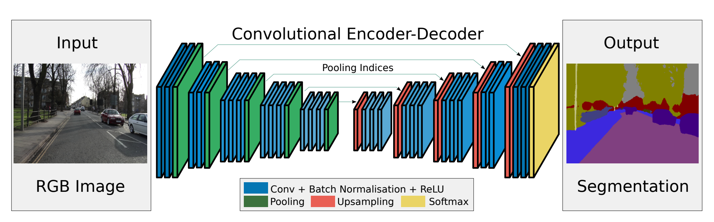

This is my pytorch implementation of a Segmentation Network model based on the following paper:
https://arxiv.org/abs/1511.00561  The name of this segmentation algorithm is called SegNet.

This segmentation algorithm has two sections: the downsampling part called the ENCODER and the upsampling part called the DECODER.

--------------------------TRAINING------------------------

INITIALIZATION
For the ENCODER part of the segnet model, the CNN and batchnormalizations weights were initialized to the CNN and
batchnormalizations weights from the classification network vgg16_batch. (The fully connected layer parameters were ignored)
This part is performed by load_vgg16_cnn_encoder_weights function in LoadWeights.py

For the DECODER part the cnn weights were initialize to a gaussian distribution and the batchnormalizations weights to default parameters. 

DATASET
The segmentation model is trained to recognize roads from backgrounds using a dataset from Kitti:
http://www.cvlibs.net/datasets/kitti/eval_road.php

SAVING & LOADING MODEL
Once the model weights are trained it is stored in a pickle file using save_weights_as_pickleFile from LoadWeights.py. If it requires
more epoch runs, load the previous trained model, train it, and store it again. Keep doing this until fully trained. Use
load_weights_from_pickleFile from LoadWeights.py to load pretrained weights.

FILES INVOLVED
Main: sample_seg.py (Run this to train)
Dependency: LoadWeights.py
Dependency: segnet_model.py
Dependency: data_loader.py

---------------------------TEST-----------------------------

LOAD MODEL
Use load_weights_from_pickleFile from LoadWeights.py to load pretrained weights.

DATASET
Use any dataset you desire

FILES INVOLVED
Main: forward_test.py (Run this to test)
Dependency: LoadWeights.py
Dependency: segnet_model.py
Dependency: data_loader.py

